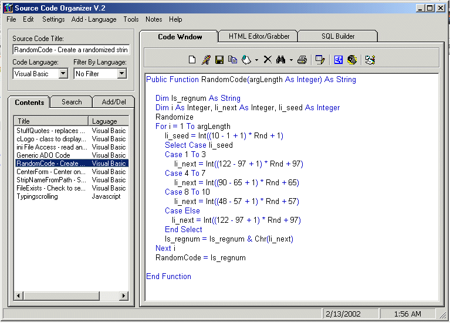



## SourceCodeOrganizer

### Description

SCO is a code snippits organizer built-in with HTMl editor ,SQL builder,Database scanner and a file viewer.Although, most of the code was taken from PSC but I did a lot of changes and added more features.I would like to give credit to Mark Joyal for his excellent code.BTW I don't expect a vote but if you do it will be appreciated.
 
### More Info
 

             |
---                |---
**Submitted On**   |2002-02-13 01:31:20
**By**             |[Dexter Zafra](https://github.com/Planet-Source-Code/PSCIndex/blob/master/ByAuthor/dexter-zafra.md)
**Level**          |Beginner
**User Rating**    |4.8 (72 globes from 15 users)
**Compatibility**  |VB 5\.0, VB 6\.0
**Category**       |[Complete Applications](https://github.com/Planet-Source-Code/PSCIndex/blob/master/ByCategory/complete-applications__1-27.md)
**World**          |[Visual Basic](https://github.com/Planet-Source-Code/PSCIndex/blob/master/ByWorld/visual-basic.md)
**Archive File**   |[SourceCode550432132002\.zip](https://github.com/Planet-Source-Code/dexter-zafra-sourcecodeorganizer__1-31763/archive/master.zip)

